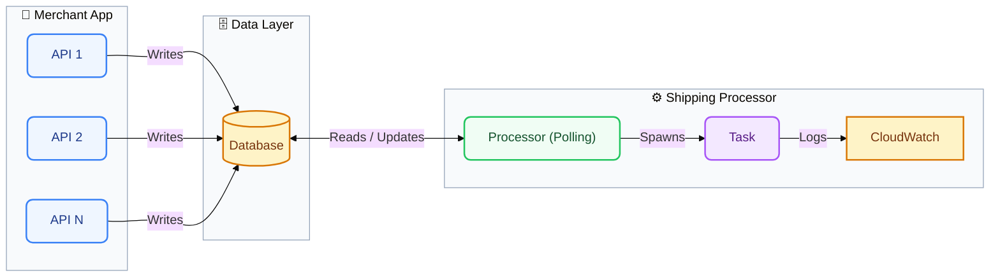
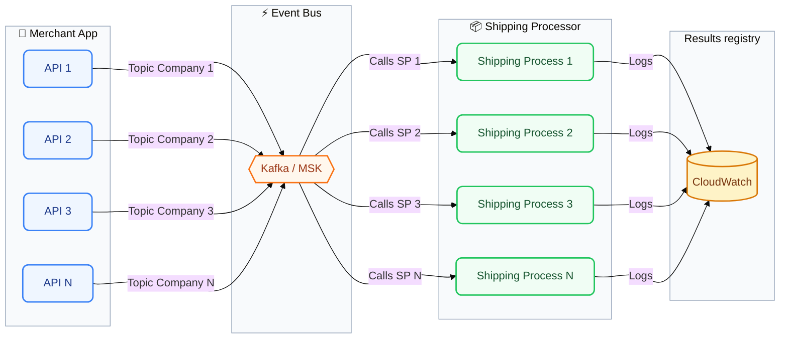

# CLAUDE.md

This file provides guidance to Claude Code (claude.ai/code) when working with code in this repository.

## Purpose

A demo comparing two approaches to the same business logic — shipping task processing — to illustrate cost and operational differences:

- **solution-basic**: a long-running process that continuously polls a MySQL database for new records and executes tasks.
- **solution-kafka**: an event-driven replacement using a Kafka broker on a VM and AWS Lambda functions triggered by Kafka events.
- **producer**: a Next.js web app that creates tasks in MySQL and shows real-time processing status, used to drive both demos.

## Architecture

### solution-basic — Polling Model



The processor is always on, polling the database in a loop. For demo purposes, each task logs a message to CloudWatch. Cost driver: idle compute time between tasks.

### solution-kafka — Event-Driven Model



Each merchant API publishes to a per-company Kafka topic. Lambda functions are triggered per topic and execute only when there is work to do, eliminating idle compute and decoupling producers from consumers.

### producer — Web Application

- **Stack**: Next.js + React, Tailwind CSS (utility styling), MUI (layout components), Node.js backend, MySQL, Kafka client.
- **Features**:
  - List tasks with `id`, `date_created`, `date_processed`, `metadata`
  - Create a task (persisted to MySQL)
  - Real-time notification when a task is processed (Kafka consumer or WebSocket push)

## Deployment

### Development

- LocalStack
- awscli-local
- Kafka (EC2)
- MySQL (RDS)
- aws-sam-cli

### Production

- AWS / CloudFormation
- Kafka (EC2 — M7i-flex.large)
- MySQL (RDS — db.t4g.micro)
- awscli

## Development Approach

Before writing or changing code, do a focused review of the existing code and describe how it works. Then produce a concrete plan before making changes. Suggest a small, verifiable step after each discrete change.

When there are choices to make (library, pattern, trade-off), surface them explicitly rather than picking silently. Ask for clarification if anything is unclear or ambiguous before proceeding.

For anything touching input handling, authentication, or external data: perform an additional security review and show reasoning.

Consider operational concerns at every step — how the service is hosted, monitored, and maintained — and flag them where relevant.

When naming something by convention, surround it in double colons and uppercase: `::VARIABLE_NAME::`.

Prefer explanations over code when possible; produce code examples for complex logic or when explicitly asked.

## Commands

```bash
# producer web app
cd producer && npm run dev        # start Next.js dev server
cd producer && npm run build      # production build
cd producer && npm run lint       # ESLint

# solution-basic processor
cd solution-basic && npm start    # start polling processor

# solution-kafka lambdas
cd solution-kafka && npm run deploy  # deploy via SAM/CDK
```
## Non overridable rules

- Use 'pnpm' instead of 'npm'
- Use awscli-local even for development, localstack is already configured on environment, so any infra o service should be created with awscli-local
