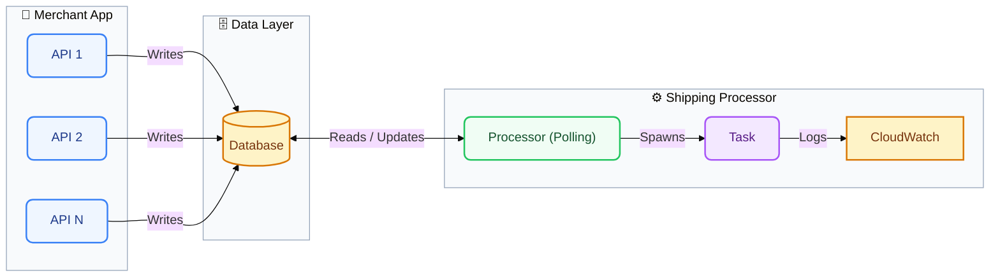

# Basic Solution Architecture

## Diagram

## Process Polling

- Small NodeJS application that reads records from the MySQL database, and invokes a task.
- For demo purposes, task objective is to log a simple message into CloudWatch.
