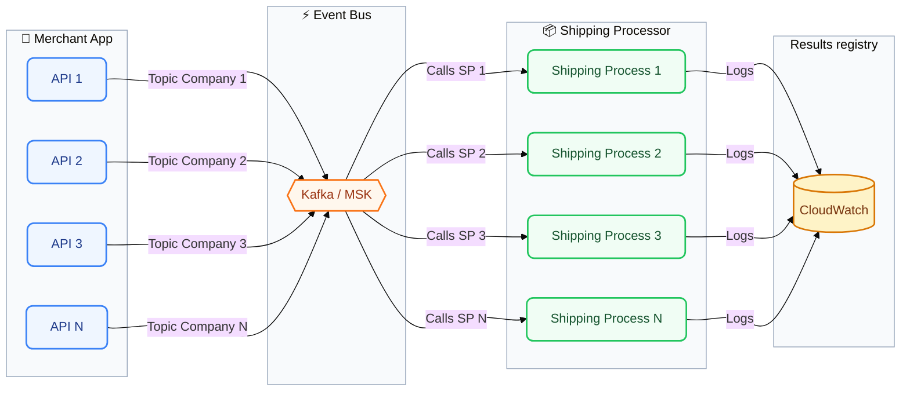

# Kafka Solution Architecture

## Diagram

## Lambdas

- Lambdas are written as simple nodejs scripts, that take the content of the notification messages.
- Must launch 4 different lambda functions, for the purpose of event sources, there should be 4 different topics for triggering the corresponding lambda.
- All the lambda functions share the same codebase.
- Lambda functions objective is just log the message contents along with the topic name to Cloudwatch
